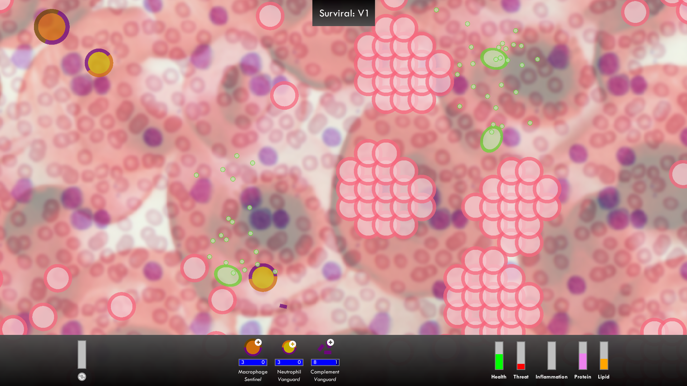

## Uperqt - BA thesis
- Game engine: __Unity__
- Contribution: __Louis BANDELIER__

A collaboration with [Cod.Act](https://codact.ch/en/) for their UPERQT project featuring a duel between two real robots.
The goal was to develop an artificial intelligence to handle the robots' behaviors.
In the end, a reinforcement learning approach gave them both precise and organic movements and allowed them to constantly adapt to each others.  
**Keywords**: Articulated Robot, Machine learning, Reinforcment Learning, ML-Agents, Unity.

- Demonstration: [https://youtu.be/GXFP9obxsug](https://youtu.be/GXFP9obxsug)
- [Project poster](uperqt_poster.pdf) (FR)

## Valdi & the 4 Seasons
- Game engine: __Unity__
- Contribution (Game Logic, Render Pipeline, Particle Effects, Lighting, Animation, Season Transition Effect):
  - __Louis BANDELIER__, __Massimo DE SANTIS__, __Dimitri KOHLER__, __Julien DOS SANTOS FERREIRA__

Demonstration: [https://youtu.be/zzIR6NazFuk](https://youtu.be/zzIR6NazFuk)

## Surviral
- Game engine: __libGDX__
- Contribution: __Louis BANDELIER__, __Massimo DE SANTIS__, __Dimitri KOHLER__

A strategy game based on the human immune system. 2D Game developped in Java with Eclipse and LibGDX.

## 360° HE-Arc
- Game engine: __Unity__
- Contribution: __Louis BANDELIER__

Demonstration: [https://youtu.be/wWhQ7abRNOc](https://youtu.be/wWhQ7abRNOc)

