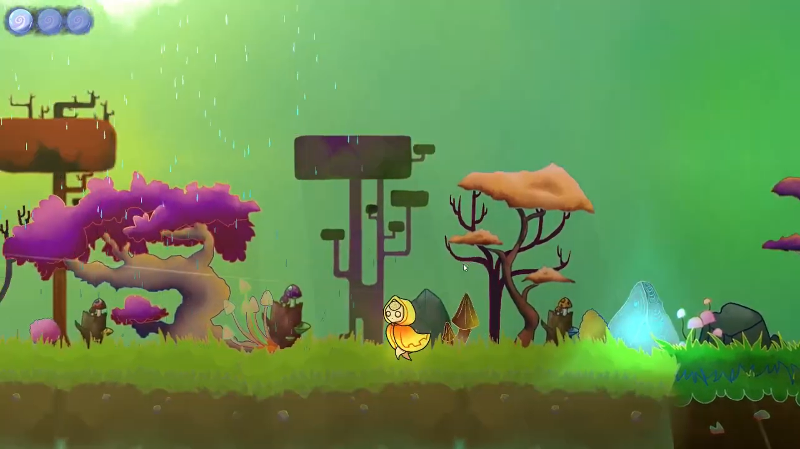
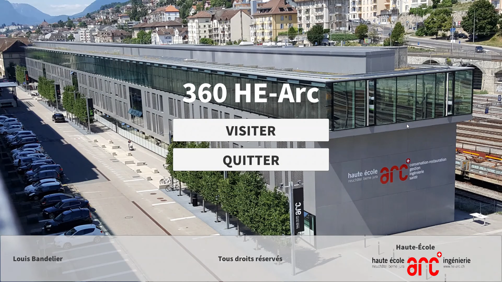

## Uperqt - BA thesis
- [Project poster](uperqt_poster.pdf) (FR)

## Valdi & the 4 Seasons
Contributors (Game Logic, Render Pipeline, Particle Effects, Lighting, Animation, Season Transition Effect):
- Louis BANDELIER, Massimo DE SANTIS, Dimitri KOHLER, Julien DOS SANTOS FERREIRA.

Demonstration video:
- [https://youtu.be/zzIR6NazFuk](https://youtu.be/zzIR6NazFuk)

## 360° HE-Arc
Contributors: Louis BANDELIER.

Demonstration video: [https://youtu.be/wWhQ7abRNOc](https://youtu.be/wWhQ7abRNOc)

